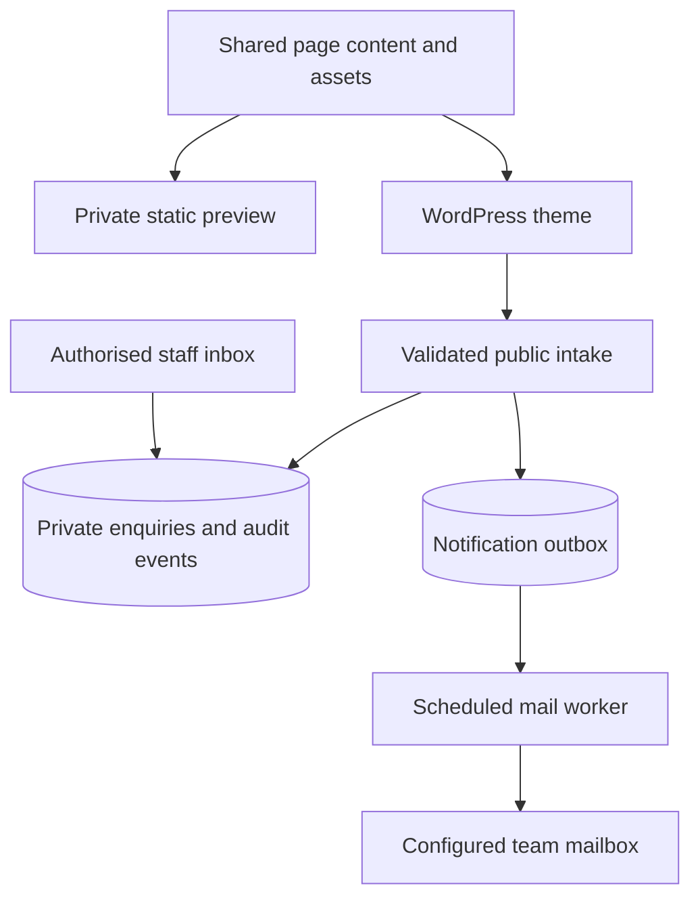

# SIT Technology architecture

## Business direction

SIT Technology should sell an accountable delivery partnership: UK client coordination, African engineering talent, and practical progress from discovery through delivery. Lead with the client’s challenge. Present language and platform breadth as supporting capability, with relevant engineers and experience confirmed for each engagement.

The primary journeys are **modernise technology**, **build a digital product**, and **extend an engineering team**. AI-assisted development belongs within a disciplined engineering process: agreed tools and data access, review, testing and accountable ownership. Avoid presenting “vibe coding” as an enterprise quality promise.

The reference firms offer useful patterns: consultancy depth, industry context, clear outcomes, and a credible talent model. SIT’s own proposition should be proportionate to the team and evidence available. See [design-research.md](design-research.md) for the six-site comparison and its implemented adaptations, and the full strategy document for the longer-term plan.

## Release architecture

The static preview has no application backend, analytics or enquiry storage. It is an owner-private design review surface. WordPress is the production CMS and enquiry system once installed and configured on suitable hosting.

### Presentation

A lightweight classic theme, `sit-technology`, uses `theme.json`, editor styles and normal editable WordPress Pages. This is not a Full Site Editing block theme. Source HTML is intentionally shared with the static preview; custom page layout edits may require the editor’s code view. The design system includes dominant apple-yellow and orange surfaces, light yellow reading surfaces, crimson accents, charcoal text and silver-grey details, self-hosted Manrope typography and one original glass bridge artwork.

Theme content is under `content/pages.json`. Source copy and interactive templates are authored in `scripts/author.py` and `scripts/redesign.py`; after changing it, regenerate with `python3 scripts/author.py` then `python3 scripts/build-preview.py`. Editing WordPress page content does not synchronise back to these source files. Once production content is edited in WordPress, treat its database as the editorial authority and deliberately bring approved changes back to source when updating the preview. The starter setup preserves matching existing pages by default. An explicit administrator checkbox can refresh only pages carrying SIT starter metadata, saving a revision first. This replaces their content; take a backup and use staging before choosing it.

The primary menu can be replaced with a WordPress menu. The footer, logo wordmark and enquiry form layout remain theme templates in this release. The project form stays outside editable page content so WordPress sanitisation does not remove its controls.

### Discovery components

Four allowlisted `[sit_component name="..."]` shortcodes render the ambition explorer, service finder, industry explorer and AI planner from trusted theme templates. This preserves controls that WordPress content sanitisation would otherwise strip. The static generator expands the same templates. Page prose remains editable, while component structure and its copy remain source-managed in this release.

`discovery.js` supplies disclosure, tab, filter, search, planner and print interactions. Native controls and semantic roles provide keyboard access; full assistive-technology testing remains a staging check. `redesign.css` layers the redesigned layout over the shared base styles.

Static search uses a curated public-page catalogue. WordPress search uses up to 200 published, non-password-protected Pages and Posts ordered by title, with titles, descriptions and permalinks supplied through the normal script-data API. Matching happens locally in the browser. Private custom enquiry tables are never queried. This is a lightweight catalogue search, not a full-content search engine. Sites with more content should use pagination or a dedicated search endpoint.

The five-question AI planner is a local rules-based guide, not an AI API or formal readiness audit. It stores and sends no answers. Any missing fundamental suggests discovery; mixed answers suggest a pilot; established fundamentals suggest controlled delivery planning. Results link to the project enquiry.

The Company capabilities page uses native printing with a print stylesheet; no generated server-side PDF or download service is required.

### Enquiry domain

The `sit-technology-core` plugin owns all business data. Changing themes or deactivating the plugin does not delete enquiries. It creates four private custom tables:

| Table suffix | Contents | Access |
|---|---|---|
| `sit_enquiries` | Reference, hashed idempotency key, payload hash, contact/project fields, immutable request type, validated detail JSON, consent timestamp, status, assignee, row version and timestamps | Staff capability only |
| `sit_events` | Enquiry lifecycle event, actor and timestamp | Staff capability only |
| `sit_outbox` | Notification state, attempts, availability and worker lease | Staff inbox status; scheduled worker |
| `sit_rates` | Salted connection-address/time-bucket hash and counter | Internal only; expired buckets deleted |

All tables require InnoDB. Enquiry creation, the first audit event and the outbox entry commit together. No public list or detail endpoint exposes submitted enquiries.

### HTTP contract

| Method and path | Purpose | Boundary |
|---|---|---|
| `GET /wp-json/sit/v1/enquiry-token` | Short-lived signed form token | Public only when enquiries are enabled; no-store |
| `POST /wp-json/sit/v1/enquiries` | Create an enquiry | Same-origin check, valid token, rate limit, typed field validation, consent and idempotency key |
| WordPress admin pages/actions | Read and update enquiries | `manage_sit_enquiries`; mutations also require an action-specific WordPress nonce |

A token expires after 30 minutes. It is a form integrity control, not proof of identity or a CAPTCHA. Bots can obtain public tokens. Rate limiting currently allows eight attempts per connection address per 15-minute bucket. Hosting must configure the trusted client connection address; otherwise users behind the same reverse proxy may share a limit. Do not blindly trust forwarded headers.

Repeated submissions with the same UUID and normalised payload return the existing reference. Reusing that UUID with a changed payload returns a conflict. References contain no contact details and there is no unauthenticated lookup route. The browser preserves its UUID during retries, but not across a reload.

### Staff workflow

The unified desk handles General enquiry, Consultation, Software project and Dedicated team requests. Its counts use actual stored data; filters combine request type, status, assigned-to-me/unassigned and reference/organisation search. Requests enter New and progress through controlled review, waiting, proposal, agreed and closed states. See [request-workflows.md](request-workflows.md) for allowed transitions. Updates require an eligible assignee, lock the row and compare a monotonic version before changing it. The version and audit event commit with the change. All staff holding the request capability can access all requests; assignment filters are workflow aids, not record-level permissions.

Only administrators receive the enquiry capability at activation. Grant it to an intentionally selected role through the hosting team’s normal role-management process. Content editors do not receive it automatically.

### Upgrade and typed payloads

Core 0.2.0 adds request type, detail JSON and a version counter to the existing enquiry table. The administrator-controlled upgrade verifies InnoDB and required new columns before recording the schema version. Existing rows become General enquiries through database defaults; no records or settings are replaced. A schema mismatch pauses intake, the request desk and workers. Theme 0.3.0 requires Core 0.2.0 or newer for live intake.

Typed requests carry flat, allowlisted fields over the existing endpoint. The server validates type-specific values and serialises only those fields into ordered detail JSON. It rejects unknown keys, including status/assignee injection and fields belonging to another type. Older untyped payloads retain the exact original canonical representation so their idempotency hashes still match. WordPress privacy exports include the request type and known detail fields; erasure and retention cover the same record and its linked events/outbox.

### Notifications and retention

The scheduled worker sends only the reference and a private staff-inbox link to the configured team mailbox. It does not email prospect data or copy the full request into message bodies. `accepted_by_transport` means `wp_mail` accepted the message, not that the recipient received it.

A worker claims each job atomically, retries failures up to five attempts, and uses a ten-minute lease. Delivery is at least once: a crash after mail acceptance but before the database acknowledgement can cause a repeated notification. A transport webhook and provider-level idempotency are later enhancements.

Retention is an explicit administrator setting and applies to all statuses. A five-minute scheduled task deletes up to 100 expired enquiries per run, including related events and outbox entries. WordPress verified privacy export and erasure workflows are registered. Backups and external email systems require their own documented retention process.

### Integration roadmap

Zoho Bigin should be a downstream projection of the WordPress enquiry, using an authenticated server-side adapter, a separate durable outbox, remote record IDs, retry/backoff and reconciliation. No Bigin synchronisation is implemented in Core 0.2.0. Do not expose Bigin credentials in theme JavaScript.

File intake needs private object storage, size/type verification, malware scanning, short-lived downloads, retention and per-record permissions before activation. Client portals require real authentication and record-level authorisation. Neither is simulated as an operational feature in this release.

## Authoritative technical references

- [WordPress theme functions](https://developer.wordpress.org/themes/classic-themes/basics/theme-functions/)
- [WordPress script loading](https://developer.wordpress.org/reference/functions/wp_enqueue_script/)
- [Custom REST endpoints and permission callbacks](https://developer.wordpress.org/rest-api/extending-the-rest-api/adding-custom-endpoints/)
- [Plugin database tables and dbDelta](https://developer.wordpress.org/plugins/creating-tables-with-plugins/)

## Legacy replacement scope

The actual public/admin platform audit expands the required migration beyond marketing and enquiries. See [wordpress-migration-blueprint.md](wordpress-migration-blueprint.md) for unified requests, scheduling, recruitment, content modules, scoped communications and cutover. No legacy business data or credentials have been imported.
